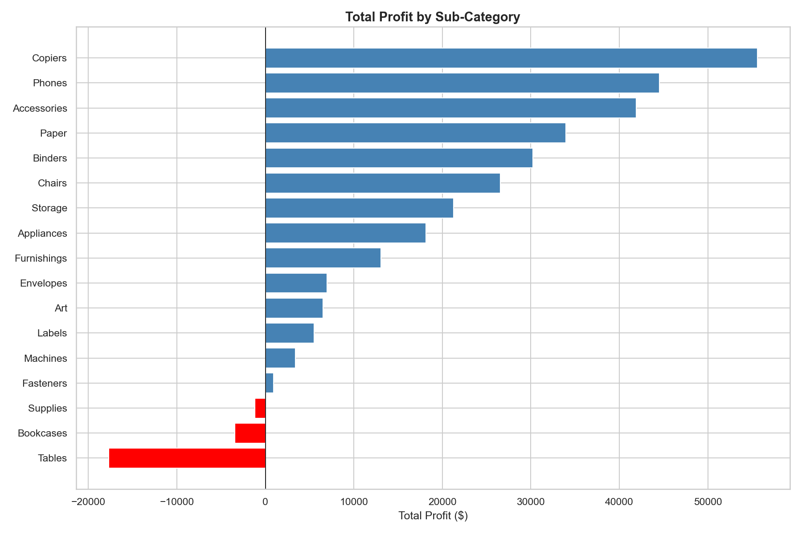
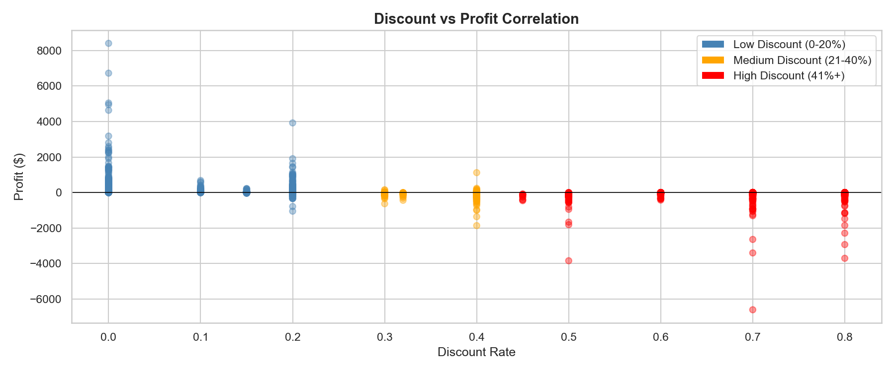
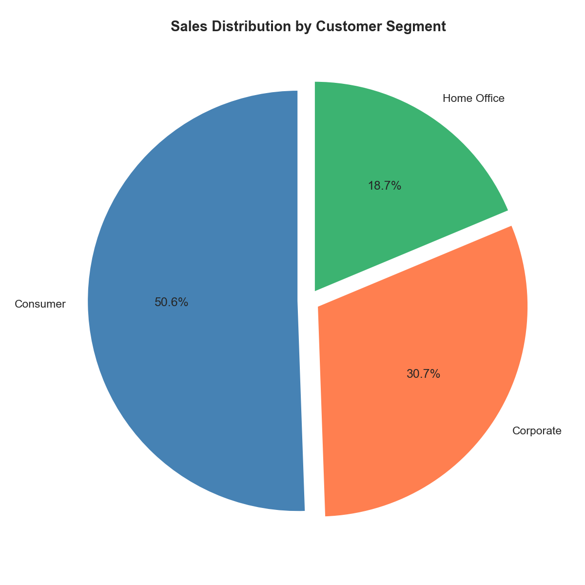

# 🛒 Retail Sales Analytics — End-to-End Data Analysis Project


## 📌 Project Overview
An end-to-end data analytics project analyzing 4 years of retail sales data from a US-based superstore to uncover trends, profitability drivers, and actionable business recommendations. This project covers the full analyst workflow — from raw data ingestion to an interactive dashboard.

## 🛠️ Tools & Technologies
| Tool | Purpose |
|------|---------|
| MySQL | Database creation & SQL business analysis |
| Python (Pandas, Seaborn, Matplotlib) | Data cleaning & exploratory data analysis |
| Excel | Pivot tables, charts & summary reporting |
| Tableau Public | Interactive multi-chart dashboard |
| GitHub | Version control & project hosting |

## 📊 Live Dashboard
🔗 [View Interactive Tableau Dashboard](https://public.tableau.com/app/profile/sreejoy.garg/viz/SuperstoreSalesProfitAnalysisDashboard_17812501411430/SuperstoreSalesProfitAnalysisDashboard?publish=yes)

## 🔍 Key Findings

### 1. 💸 Heavy Discounting Destroys Profit
Orders with discounts above 40% generate an average loss of $106 per order, resulting in a cumulative loss of $99,558 from high-discount orders alone. Even medium discounts (21-40%) produce an average loss of $77 per order.

### 2. 🪑 Furniture Category is Bleeding Money
Despite generating $741,306 in revenue, the Furniture category produces only $18,421 in profit — a margin of just 2.4%. The Tables sub-category alone lost $17,725, making it the single biggest loss-making product group.

### 3. 🌍 West Region Leads in Sales
The West region drives the highest revenue at $725,256, followed closely by East at $678,435. Together they account for over 60% of total company revenue.

### 4. 👥 Consumer Segment Dominates
The Consumer segment accounts for the largest share of sales at 51%, making it the most important customer group to retain and grow.

### 5. 💻 Technology is the Star Category
Technology has the highest profit margin among all three categories, making it the most efficient and profitable revenue driver in the business.

## 📁 Project Structure

    retail-sales-analytics/
    │
    ├── data/
    │   ├── SampleSuperstore.csv        # Original raw dataset
    │   └── superstore_clean.csv        # Cleaned dataset
    │
    ├── sql/
    │   ├── 01_create_table.sql         # Database & table creation
    │   ├── 02_data_validation.sql      # Data verification queries
    │   └── 03_business_insights.sql    # 8 business insight queries
    │
    ├── notebooks/
    │   ├── 01_data_cleaning.ipynb      # Data cleaning & preparation
    │   └── 02_eda_analysis.ipynb       # Exploratory data analysis
    │
    ├── excel/
    │   └── superstore_summary.xlsx     # Pivot table & chart summary
    │
    ├── dashboard/
    │   └── screenshots/                # Chart exports from Python & Tableau
    │
    └── README.md

## 🔄 Project Workflow
1. **Data Collection** → Downloaded Superstore dataset (9,994 rows) from Kaggle
2. **Database Setup** → Loaded data into MySQL, wrote 8 business insight queries
3. **Data Cleaning** → Removed 17 duplicate rows, added Profit Margin & Discount Band columns using Python
4. **EDA** → Built 7 visualizations in Seaborn & Matplotlib uncovering key business patterns
5. **Excel Summary** → Created pivot table with Red-White-Green conditional formatting on profit
6. **Dashboard** → Built interactive 5-chart Tableau dashboard with regional filter
7. **Publishing** → Hosted on Tableau Public & version controlled on GitHub

## 📈 Visualizations

### Profit by Sub-Category


### Discount vs Profit Correlation


### Sales by Segment


## 💡 Business Recommendations
1. **Cap discounts at 20%** — any discount above 20% results in below-average profit and above 40% results in guaranteed losses
2. **Review Furniture pricing strategy** — Tables and Bookcases are consistently loss-making despite high sales volumes
3. **Focus marketing spend on West & East regions** — they generate the highest revenue and have the strongest customer base
4. **Double down on Technology category** — highest margins and consistent profitability across all regions
5. **Protect Consumer segment** — majority revenue driver, retention strategies should be prioritized here

## 📦 Dataset
- **Source:** [Kaggle - Sample Superstore](https://www.kaggle.com/datasets/bravehart101/sample-supermarket-dataset)
- **Size:** 9,994 rows × 13 columns
- **Time Period:** 4 years of US retail transactions
- **Categories:** Furniture, Office Supplies, Technology

## 🚀 How to Run This Project
1. Clone the repository
```bash
git clone https://github.com/Sreejoy2024/retail-sales-analytics.git
```
2. Set up MySQL database using scripts in `/sql` folder
3. Run Jupyter notebooks in `/notebooks` folder in order
4. Open `/excel/superstore_summary.xlsx` for pivot summary
5. View live dashboard via Tableau Public link above

## 👤 Author
**Sreejoy Garg**
- GitHub: (https://github.com/Sreejoy2024)
- LinkedIn:(https://www.linkedin.com/in/sreejoy-garg-637829277/)
